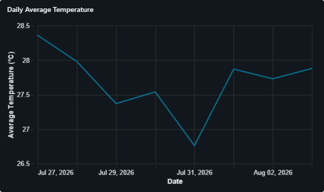
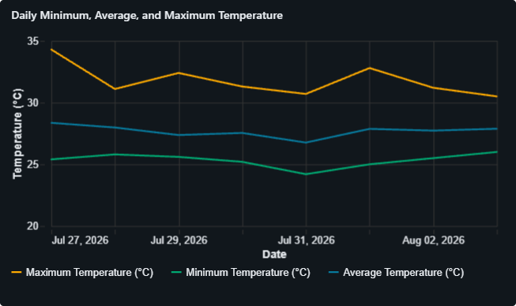
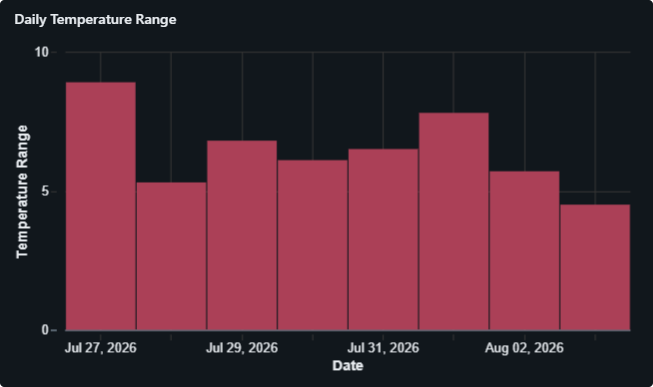

# Bangkok Weather Pipeline

An end-to-end data engineering project that ingests hourly Bangkok weather data from the Open-Meteo API and processes it through Bronze, Silver, and Gold layers using Python, PySpark, SQL, Delta Lake, and Databricks.

The final Gold table is used to power a Databricks AI/BI dashboard for daily temperature analysis.

## Project Goals

- Extract weather data from a public API
- Build a Bronze, Silver, and Gold data pipeline
- Store data in Delta tables
- Transform and validate data with PySpark
- Aggregate reporting metrics with SQL
- Build an interactive Databricks dashboard
- Prepare the pipeline for scheduled automation
- Apply practical data engineering and data-quality techniques

## Architecture

```text
Open-Meteo API
      ↓
Bronze Delta Table
      ↓
Silver Delta Table
      ↓
Gold Daily Table
      ↓
Databricks AI/BI Dashboard
````

## Tech Stack

* Python
* PySpark
* SQL
* Databricks
* Delta Lake
* Open-Meteo API
* GitHub

## Pipeline Layers

### Bronze Layer

The Bronze notebook calls the Open-Meteo API directly from Databricks and retrieves hourly Bangkok temperature data.

The API response is converted into a Spark DataFrame and stored in:

```text
workspace.default.bronze_weather_hourly
```

The Bronze table contains:

* `weather_timestamp`
* `temperature_celsius`

Only minimal technical processing is performed before storage, including converting timestamp strings into Spark timestamp values.

### Silver Layer

The Silver notebook reads the Bronze Delta table and prepares reliable hourly weather data.

The transformation includes:

* checking for missing values
* checking for duplicate timestamps
* removing records with missing timestamps
* removing records with missing temperatures
* removing duplicate hourly records
* filtering unreasonable temperature values
* deriving the Bangkok calendar date
* deriving the hour of the day

The cleaned records are stored in:

```text
workspace.default.silver_weather_hourly
```

The Silver table contains:

* `weather_timestamp`
* `temperature_celsius`
* `weather_date`
* `weather_hour`

### Gold Layer

The Gold notebook aggregates hourly Silver records into one reporting row per day.

The daily Gold table includes:

* average temperature
* minimum temperature
* maximum temperature
* temperature range
* recorded hourly coverage

The completed reporting table is stored in:

```text
workspace.default.gold_weather_daily
```

## Data Quality Checks

The pipeline validates:

* missing timestamps
* missing temperature values
* duplicate timestamps
* unreasonable temperature values
* incomplete daily hourly coverage
* duplicate daily Gold records
* average temperatures outside the daily minimum and maximum
* negative temperature ranges
* mismatches between the stored range and `maximum - minimum`

A timestamp-alignment issue was identified during validation and corrected so that hourly records are grouped by Bangkok local calendar dates.

## Dashboard

The Databricks AI/BI dashboard reads from the Gold reporting table and contains three visualizations.

### Daily Average Temperature

Shows the average Bangkok temperature for each day.



### Daily Minimum, Average, and Maximum Temperature

Compares the daily minimum, average, and maximum temperatures on the same timeline.



### Daily Temperature Range

Shows the daily difference between the maximum and minimum temperature.



The exported Databricks dashboard definition is stored in:

```text
dashboard/bangkok_weather_dashboard.lvdash.json
```

The JSON file can be imported back into Databricks to recreate the dashboard configuration.

## Notebook Workflow

Run the notebooks in this order:

```text
00_bronze_open_meteo_ingestion
      ↓
01_silver_weather_transformation
      ↓
02_gold_weather_daily_aggregation
      ↓
03_gold_validation_and_analysis
      ↓
Databricks dashboard refresh
```

## Future Improvements

* replace fixed request dates with dynamic date parameters
* preserve historical records instead of overwriting Bronze
* use Delta `MERGE` for incremental ingestion
* schedule the notebooks as a Databricks Job
* add failure notifications and retry monitoring
* separate completed historical observations from changing forecast data
* expand the API request with precipitation, humidity, wind, and weather-condition fields
* add dashboard date filters and longer-term trend analysis

## Data Source

Weather data is provided by the Open-Meteo API.

The project requests hourly temperature data for Bangkok using the `Asia/Bangkok` timezone.

```
```

