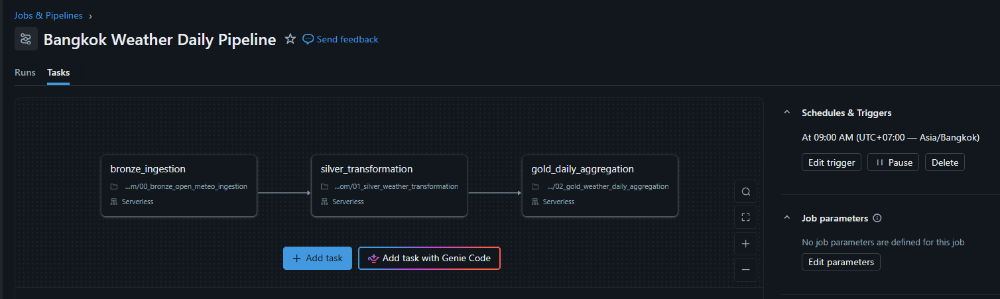

# Bangkok Weather Pipeline

An end-to-end data engineering project that ingests hourly Bangkok weather data from the Open-Meteo API and processes it through Bronze, Silver, and Gold layers using Python, PySpark, SQL, Delta Lake, and Databricks.

The pipeline automatically refreshes every day using Databricks Jobs. Fresh weather data is ingested directly from the Open-Meteo API, processed through the Medallion architecture, and visualized in a Databricks AI/BI dashboard.

## Project Goals

- Extract weather data from a public API
- Build a Bronze, Silver, and Gold data pipeline
- Store data in Delta tables
- Transform and validate data with PySpark
- Aggregate reporting metrics with SQL
- Build an interactive Databricks AI/BI dashboard
- Automate the pipeline using Databricks Jobs
- Apply practical data engineering and data-quality techniques

## Repository Structure

```text
bangkok-weather-pipeline/
├── notebooks/
│   ├── 00_bronze_open_meteo_ingestion.py
│   ├── 01_silver_weather_transformation.py
│   ├── 02_gold_weather_daily_aggregation.sql
│   └── 03_reporting_queries.sql
├── dashboard/
│   ├── bangkok_weather_dashboard.lvdash.json
│   ├── daily_average_temperature.png
│   ├── daily_min_avg_max_temperature.png
│   └── daily_temperature_range.png
├── docs/
│   └── databricks_job_workflow.png
├── .gitignore
├── LICENSE
└── README.md
```

## Architecture

```text
Databricks Scheduled Job (Daily 09:00 AM Asia/Bangkok)
                    ↓
              Open-Meteo API
                    ↓
             Bronze Delta Table
                    ↓
             Silver Delta Table
                    ↓
              Gold Delta Table
                    ↓
        Databricks AI/BI Dashboard
```

## Tech Stack

* Python
* PySpark
* SQL
* Databricks
* Delta Lake
* Open-Meteo API

## Pipeline Layers

### Bronze Layer

The Bronze notebook calls the Open-Meteo API directly from Databricks and retrieves hourly Bangkok temperature data.

The notebook calculates the request dates dynamically at runtime, retrieving a rolling seven-day weather forecast. The pipeline currently overwrites the Bronze table on each scheduled run so that it always contains the latest forecast window.

The API response is converted into a Spark DataFrame and stored in:

```text
workspace.default.bronze_weather_hourly
```

The Bronze table contains:

* `weather_timestamp`
* `temperature_celsius`

Only minimal technical processing is performed before storage, including converting timestamp strings into Spark timestamp values.

### Silver Layer

The Silver notebook reads the Bronze Delta table and prepares reliable hourly weather data.

The transformation includes:

* checking for missing values
* checking for duplicate timestamps
* removing records with missing timestamps
* removing records with missing temperatures
* removing duplicate hourly records
* filtering unreasonable temperature values
* deriving the Bangkok calendar date
* deriving the hour of the day

The cleaned records are stored in:

```text
workspace.default.silver_weather_hourly
```

The Silver table contains:

* `weather_timestamp`
* `temperature_celsius`
* `weather_date`
* `weather_hour`

### Gold Layer

The Gold notebook aggregates hourly Silver records into one reporting row per day.

The daily Gold table includes:

* average temperature
* minimum temperature
* maximum temperature
* temperature range
* recorded hourly coverage

The completed reporting table is stored in:

```text
workspace.default.gold_weather_daily
```

## Data Quality Checks

The pipeline validates:

* missing timestamps
* missing temperature values
* duplicate timestamps
* unreasonable temperature values
* incomplete daily hourly coverage
* duplicate daily Gold records
* average temperatures outside the daily minimum and maximum
* negative temperature ranges
* mismatches between the stored range and `maximum - minimum`

A timestamp-alignment issue was identified during validation and corrected so that hourly records are grouped by Bangkok local calendar dates.

## Dashboard

The Databricks AI/BI dashboard reads from the Gold reporting table and contains three visualizations.

### Daily Average Temperature

Shows the average Bangkok temperature for each day.


### Daily Minimum, Average, and Maximum Temperature

Compares the daily minimum, average, and maximum temperatures on the same timeline.


### Daily Temperature Range

Shows the daily difference between the maximum and minimum temperature.


The exported Databricks dashboard definition is stored in:

```text
dashboard/bangkok_weather_dashboard.lvdash.json
```

The JSON file can be imported back into Databricks to recreate the dashboard configuration.

## Pipeline Automation

The pipeline is orchestrated using **Databricks Jobs**.

A scheduled workflow runs automatically every day at **09:00 (Asia/Bangkok)**.

Execution order:

```text
bronze_ingestion
        ↓
silver_transformation
        ↓
gold_daily_aggregation
```

The Bronze notebook requests fresh weather data from the Open-Meteo API using dynamically generated dates.

Each scheduled execution refreshes the Bronze, Silver, and Gold Delta tables automatically.

The Databricks Job workflow is shown below.



## Pipeline Workflow

During development the notebooks can be executed manually in the following order:

```text
00_bronze_open_meteo_ingestion
        ↓
01_silver_weather_transformation
        ↓
02_gold_weather_daily_aggregation
        ↓
03_reporting_queries
```

In production the same workflow is executed automatically every day by a Databricks Job.

## Current Design

The pipeline maintains a rolling seven-day **hourly temperature forecast** for Bangkok.

Each scheduled execution retrieves the latest temperature forecast from the Open-Meteo API and overwrites the Bronze, Silver, and Gold tables with the refreshed seven-day window.

The current design does not preserve historical forecast snapshots or completed temperature observations.

Future versions may use Delta `MERGE` and incremental ingestion to retain historical records and track how forecasts change over time.

## Data Source

Weather data is provided by the Open-Meteo API.

The project requests hourly temperature data for Bangkok using the `Asia/Bangkok` timezone.

## Future Improvements

- Preserve historical weather records instead of overwriting Bronze
- Implement Delta MERGE for incremental ingestion
- Separate historical observations from forecast data
- Add precipitation, humidity, wind speed, and weather-condition fields
- Add automated job failure notifications and monitoring
- Expand the dashboard with filters and longer-term trend analysis


